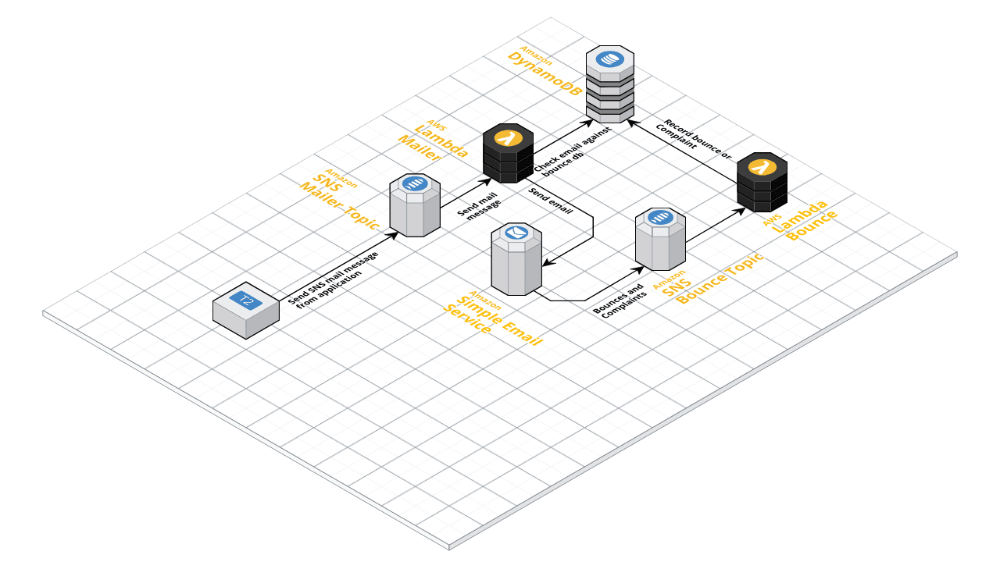

LambdaMailer
============

Description
-----------

Serverless application to send emails using SES and Lambda.

The project defines two lambda functions and a dynamodb table to keep track of bounces and complaints



### Lambda Mailer
This lambda function is triggered via SNS, and the payload of the message is
a JSON object with the following format:

```json
{
    "to": ["username@gmail.com"],
    "from": "info@mailer.mydomain.com",
    "subject": "test01",
    "body": "<h1>Test Body</h1>",
    "replyTo": "no-reply@mailer.mydomain.com"
}
```

| Field     | type         | description                                                                                 |
|-----------|--------------|---------------------------------------------------------------------------------------------|
| `to`      | List\[String\] | A list of valid email addresses                                                             |
| `from`    | String       | Email address that will be use to send the email, this must be an approved email or domain. |
| `subject` | String       | The subject of the email                                                                    |
| `body`    | String       | HTML or Plain Text body of the email                                                        |
| `replyTo` | String       | The reply-to email address, can be different from the `from` email                          |


The mailer will check each email address against the bounce dynamodb table to prevent sending emails to
addresses that have been added to this list.

### Lambda Mailer Bounce
This lambda function is triggered via SNS. The SNS message is sent by a SES
complaint or bounce notification.

Bounces and Complaints are recorded on a dynamodb table. Bounces remain on
the table for up to 7 days, complaints remain in the table permanently.
The mailer checks every email address against the dynamodb table before sending
emails. If the email is found in the table, it is filtered out.
You must subscribe the bounce and complaint notifications to the bounce. See the installation section
for more information.

Installation
------------
You must build the project before it is deployed using SBT:
```bash
sbt compile
sbt assembly
```

Use the [serverless framework](https://serverless.com/) to install this project:
```bash
serverless deploy --stage dev
```

I have provided a simple shell script to help you deploy this project
```bash
./build deploy dev
```

This will compile, create the assembly and deploy the package to lambda

### Enable bounce and complaint blocking
The lambda mailer defines a lambda function that adds bounce and complaint email addresses
to a dynamodb table.

To enable bounce and complaint blocking go `SES` > `Domains` > `Notifications` > `Edit Configuration`

Under edit configuration select the `<STAGE>-mailer-bounce` SNS Topic for both Bounces and Complaints.

Save Config, and you are done!

Uninstall
---------
```bash
./build remove dev
```
