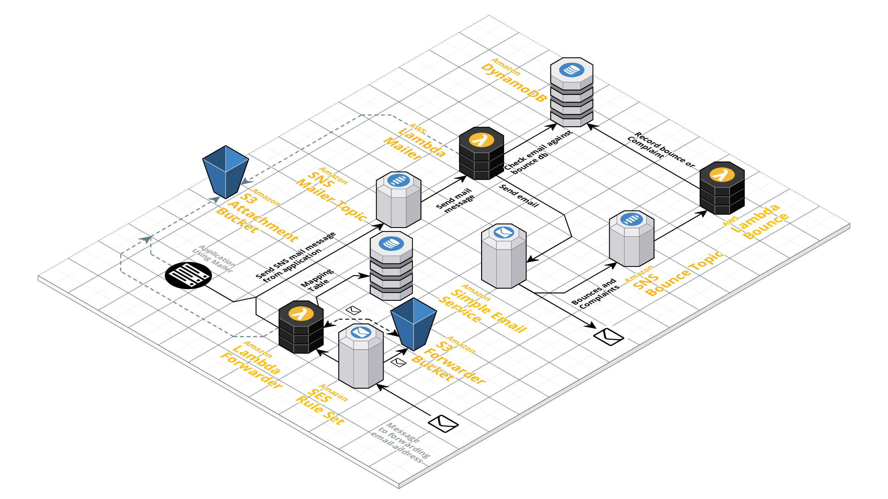

LambdaMailer
============
[](LICENSE)

## Description
LambdaMailer is a simple Serverless mailing system for AWS SES build on [µServerless](https://github.com/onema/uServerless) and [Scala](https://www.scala-lang.org/)
and deployed using the [serverless framework](https://serverless.com).

The project defines three lambda functions (mailer, bounce, and forwarder) and a dynamodb table to keep track of bounces and complaints.



### Lambda Mailer
This lambda function is triggered via SNS, and the payload of the message is
a JSON object with the following format:

```json
{
    "to": ["username@gmail.com"],
    "from": "info@mailer.mydomain.com",
    "subject": "test01",
    "body": "<h1>Test Body</h1>",
    "replyTo": "no-reply@mailer.mydomain.com",
    "raw": false,
    "attachments": ["s3/path/in/the/attachments/bucket.png"]
}
```

| Field         | type         | description                                                                                 |
|-------------- |--------------|---------------------------------------------------------------------------------------------|
| `to`          | List\[String\] | A list of valid email addresses                                                           |
| `from`        | String       | Email address that will be use to send the email, this must be an approved email or domain. |
| `subject`     | String       | The subject of the email                                                                    |
| `body`        | String       | HTML or Plain Text body of the email                                                        |
| `replyTo`     | String       | The reply-to email address, can be different from the `from` email                          |
| `raw`         | Boolean      | Specifies weather the body of the email is a raw email message (true) or text/html (false)  |
| `attachments` | List\[String\] | A list containing keys in the attachments bucket                                          |


The mailer will check each email address against the bounce dynamodb table to prevent sending emails to
addresses that have been added to this list.

### Lambda Mailer Bounce
This lambda function is triggered via SNS. The SNS message is sent by a SES
complaint or bounce notification.

Bounces and Complaints are recorded on a dynamodb table. Bounces remain on
the table for up to 7 days, complaints remain in the table permanently.
The mailer checks every email address against the dynamodb table before sending
emails. If the email is found in the table, it is filtered out.
You must subscribe the bounce and complaint notifications to the bounce. See the installation section
for more information.

### Lambda Mailer Forwarder
The forwarder allows you to receive messages sent by a SES rule set. 

The forwarder will receive emails sent to the given address and forward them to the associated email addresses.

The association is recorded in a DynamoDB table with a partition key `forwardingEmail` and a sort key `destiantionEmail` to 
uniquely identify the mapping. The dymanodb table is created in the resources section, and the name is available through 
the environment variable `MAPPING_TABLE`

In addition, you will need to set the forwarding email addresses in an active SES Rule Set.
For more information see the installation instructions below.

## Installation
You must build the project before it is deployed using SBT:
```bash
sbt assembly
```

Use the [serverless framework](https://serverless.com/) to install this project:
```bash
serverless deploy --stage dev
```

## Enable bounce and complaint blocking
The lambda mailer defines a lambda function that adds bounce and complaint email addresses
to a dynamodb table.

To enable bounce and complaint blocking go `SES` > `Domains` > `Notifications` > `Edit Configuration`

Under edit configuration select the `<STAGE>-mailer-bounce` SNS Topic for both Bounces and Complaints.

Save Config, and you are done!

## Enable email forwarding
For the forwarder to work properly, you will need to create/edit the SES Rule Set after the application has been launched:
1. Go to `SES` -> `Rule Set` -> `Vie Active Rule Set`
1. Create or edit an existing Rule Set
1. Add one or more verified recipients, these are email addresses to reach your forwarder, e.g. `spam@example.com`
1. Add an action S3. Find or select the `lambda-mailer-dev-forwarders3bucket-XXXXXXXXXX` bucket. To find the exact name of the `S3 bucket`:
    1. go to CloudFormation and select the `lambda-mailer-<STAGE>` stack
    1. select the `Outputs` section and copy the value of the `ForwarderS3BucketName` which should look like `lambda-mailer-dev-forwarders3bucket-XXXXXXXXXX`
1. Add a `Lambda` action and select the `lambda-mailer-<STAGE>-forwarder`
1. Click on `Save Rule`
1. In the Missing Permission pop-up click `Add permissions`

## Uninstall
```bash
serverless remove 
```
